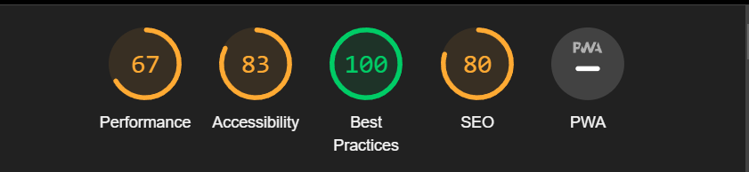
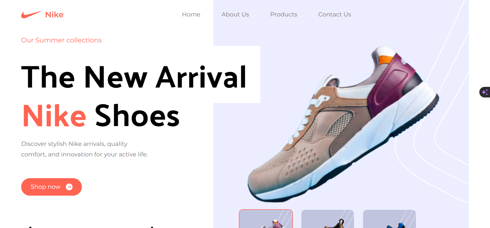
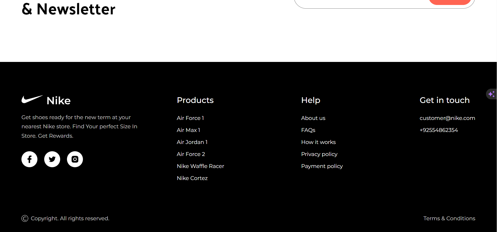

# Nike Landing Page

Ui is built using `react.js`   
Designing using `TailwindCSS`   
Build Tool `vite.js`

Well organized code, with best practices.

### Performance

## Home

## Hero

## Footer
